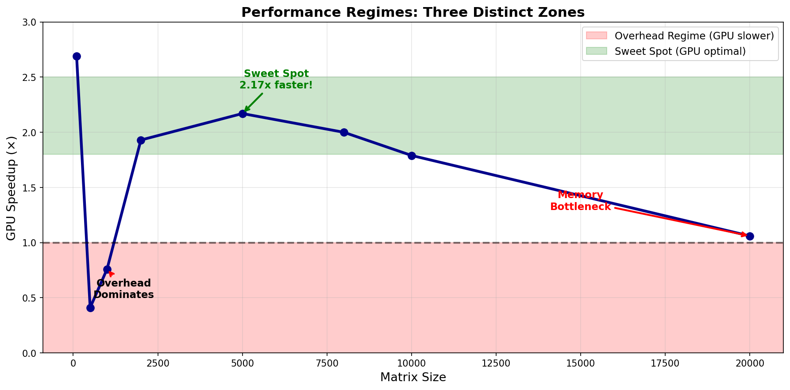
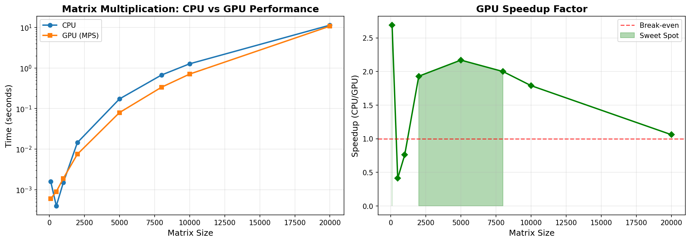
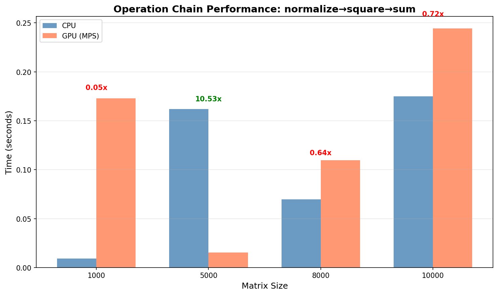

# PyTorch Performance Lab

**A GPU workload behavior laboratory for performance engineering on Apple Silicon**

[](https://www.python.org/downloads/)
[](https://pytorch.org/)
[](https://opensource.org/licenses/MIT)

---

## 🎯 Goal

This repository documents systematic performance analysis of GPU-accelerated tensor operations on Apple M4 hardware. Through rigorous benchmarking, I identify:

- **Performance regimes** where GPU acceleration provides benefit
- **Bottlenecks** that limit scaling (overhead, memory bandwidth, kernel launch costs)
- **Optimal workload sizes** for different operation types
- **Real-world implications** for ML training pipeline optimization

**Why this matters:** Not all ML workloads benefit from GPU acceleration. Understanding when and why GPUs help—or hurt—performance is critical for production systems.

---

## 🔬 Key Discoveries

### 1. Three Distinct Performance Regimes

| Regime | Workload Size | GPU Speedup | Limiting Factor |
|--------|--------------|-------------|-----------------|
| **Overhead Dominance** | < 2,000 | 0.4x - 0.8x | Data transfer cost > computation benefit |
| **Sweet Spot** | 5,000 - 8,000 | 2.0x - 2.2x | Parallel computation dominates |
| **Memory Wall** | > 10,000 | 1.0x - 1.5x | Bandwidth saturation |



### 2. Operation-Specific Scaling Behavior

Different operations exhibit vastly different performance profiles:

**Matrix Multiplication:**
- Single heavy kernel
- Wide sweet spot (5K-8K elements)
- Graceful degradation at large sizes

**Operation Chains (normalize→square→sum):**
- Multiple kernel launches (6+)
- Narrow sweet spot (~5K)
- Earlier bottleneck onset (~8K vs ~20K)

**Key Insight:** Kernel launch overhead scales with operation count, not data size.

### 3. Memory Bandwidth as Primary Constraint

At 20,000×20,000 matrices:
- Data volume: ~1.6GB per tensor
- Total memory traffic: ~5GB (inputs + intermediates + outputs)
- Result: GPU advantage nearly eliminated (1.06x speedup)

**Implication:** For production ML, memory access patterns matter as much as FLOPS.

---

## 📊 Benchmark Methodology

### Rigorous Performance Measurement

```python
def benchmark_matmul(size):
    cpu_tensor = torch.randn(size, size)
    gpu_tensor = cpu_tensor.to("mps")
    
    # CRITICAL: Warmup run
    _ = gpu_tensor @ gpu_tensor
    torch.mps.synchronize()  # Wait for async GPU
    
    # Timed CPU execution
    start = time.time()
    _ = cpu_tensor @ cpu_tensor
    cpu_time = time.time() - start
    
    # Timed GPU execution
    start = time.time()
    _ = gpu_tensor @ gpu_tensor
    torch.mps.synchronize()  # MUST synchronize!
    gpu_time = time.time() - start
    
    return cpu_time, gpu_time
```

### Key Practices

✅ **Warmup runs** - First GPU execution includes JIT compilation overhead  
✅ **Explicit synchronization** - GPU operations are async; must wait for completion  
✅ **Multiple measurements** - Account for system variability  
✅ **Controlled environment** - Close background processes, consistent thermal state

### System Variability Observed

Repeated benchmarks showed ±10% variance due to:
- Thermal throttling (M4 gets warm)
- Background process interference
- Memory cache state
- macOS system activity

**Mitigation:** Run benchmarks 3-5 times, report median values.

---

## 📈 Results

### Matrix Multiplication Performance (Apple M4 Mini)



| Size | CPU Time | GPU Time | Speedup | Regime |
|------|----------|----------|---------|--------|
| 1,000 | 0.0015s | 0.0019s | 0.76x | Overhead ❌ |
| 2,000 | 0.0145s | 0.0075s | 1.93x | Transition |
| 5,000 | 0.1726s | 0.0796s | **2.17x** | Sweet Spot ⭐ |
| 8,000 | 0.6716s | 0.3359s | **2.00x** | Sweet Spot ⭐ |
| 10,000 | 1.2671s | 0.7067s | 1.79x | Degrading |
| 20,000 | 11.36s | 10.73s | 1.06x | Memory Wall ❌ |

### Operation Chain Performance



**Operation sequence:** normalize → square → sum (6 kernel launches)

| Size | CPU Time | GPU Time | Speedup | Bottleneck |
|------|----------|----------|---------|------------|
| 1,000 | 0.0093s | 0.1730s | **0.05x** | Overhead dominates |
| 5,000 | 0.1621s | 0.0154s | **3.56x** | Optimal! |
| 8,000 | 0.0698s | 0.1097s | 0.64x | Memory pressure |
| 10,000 | 0.1749s | 0.2445s | 0.72x | Bandwidth limited |

**Critical finding:** Operation chains hit memory bottleneck **2.5x earlier** than single operations.

---

## 💡 Lessons Learned

### 1. Bigger Workloads ≠ Better Performance

**Discovery:** Beyond 8,000×8,000 matrices, GPU speedup *decreased* despite larger computational workload.

**Root cause:** Memory bandwidth saturation. At 20K×20K:
- Computation scales as O(n³)
- Memory transfer scales as O(n²)
- But bandwidth is fixed → bottleneck shifts from compute to memory

**Real-world implication:** Training batch size should target the sweet spot, not max out GPU memory.

### 2. Kernel Launch Overhead is Real

**Discovery:** Operation chains (6 kernels) showed 2.5x narrower sweet spot than matrix multiplication (1 kernel).

**Root cause:** Each kernel launch has fixed overhead (~0.01s). For lightweight operations, overhead dominates.

**Real-world implication:** Prefer fused operations in production (e.g., `F.gelu` vs separate ops).

### 3. Profiling Beats Intuition

**Discovery:** Assumed element-wise operations would benefit from parallelism. Reality: GPU was **consistently slower**.

**Root cause:** Transfer overhead exceeds trivial computation time.

**Real-world implication:** Always profile. "GPU-accelerate everything" is wrong. Strategic placement matters.

### 4. Thermal Throttling Affects Benchmarks

**Discovery:** Consecutive benchmark runs showed performance degradation over time.

**Root cause:** M4 thermal limits. Sustained load → throttling → slower execution.

**Real-world implication:** Production inference should monitor thermal state and adjust batch sizes dynamically.

### 5. Synchronization is Critical

**Discovery:** Initial benchmarks showed unrealistic speedups (100x+).

**Root cause:** Forgot `torch.mps.synchronize()`. Measured kernel *launch* time, not *execution* time.

**Real-world implication:** GPU profiling requires explicit synchronization. Async execution hides true costs.

---

## 🛠️ Repository Structure
pytorch-performance-lab/
├── notebooks/               # Jupyter analysis notebooks
│   ├── 01_tensor_fundamentals.ipynb
│   ├── 02_gpu_benchmarking.ipynb
│   ├── 03_gradients_and_learning.ipynb
│   └── 04_multi_parameter_learning.ipynb
├── docs/                    # Technical documentation
│   ├── performance_regimes.md
│   └── learning_notes.md
├── results/
│   ├── charts/              # Performance visualizations
│   └── benchmarks/          # Raw CSV data
├── utils/
│   ├── benchmark_tools.py   # Reusable benchmark utilities
│   └── generate_charts.py   # Visualization generation
├── README.md
└── requirements.txt


---

## 🚀 Quick Start

```bash
# Clone repository
git clone https://github.com/rap7239/pytorch-performance-lab.git
cd pytorch-performance-lab

# Install dependencies
pip install -r requirements.txt

# Run benchmarks
python utils/benchmark_tools.py

# Generate charts
python utils/generate_charts.py

# Explore notebooks
jupyter notebook
```

---

## 🔮 Future Work

### Immediate Next Steps
- [ ] **PyTorch Profiler integration** - Detailed kernel-level analysis
- [ ] **Mixed precision benchmarks** - FP16 vs FP32 performance
- [ ] **Batch size optimization** - Find optimal batch for training loops
- [ ] **DataLoader profiling** - I/O vs compute bottleneck analysis

### Advanced Topics
- [ ] **Multi-GPU scaling** - Investigate distributed training overhead
- [ ] **Custom CUDA kernels** - Compare with PyTorch ops
- [ ] **Memory profiling** - Track allocation patterns
- [ ] **Automated regression testing** - CI/CD for performance
- [ ] **Real model benchmarks** - ResNet, Transformer inference/training

### Production Readiness
- [ ] **Dashboard** - Real-time performance monitoring
- [ ] **Alerting** - Detect performance degradation
- [ ] **Optimization recommendations** - Automated tuning suggestions

---

## 📚 Technical Stack

- **Language:** Python 3.11
- **Framework:** PyTorch 2.8 with MPS backend
- **Hardware:** Apple M4 Mini (unified memory architecture)
- **Visualization:** matplotlib, pandas
- **Environment:** Jupyter Notebook

---

## 👤 Author

**Rahul Punde**  
Building ML performance engineering expertise through systematic experimentation.

**Focus areas:**
- GPU workload optimization
- Training pipeline performance
- Production ML observability
- Hardware-aware algorithm design

---

## 📄 License

MIT License - Free to use for learning and experimentation.

---

## 🙏 Methodology Notes

All benchmarks conducted on:
- **Hardware:** Mac M4 Mini
- **OS:** macOS (latest)
- **Power:** Plugged in, high-performance mode
- **Background:** Minimal processes, browser closed
- **Thermal:** Cool start, monitored throughout

Benchmark data and visualization scripts included for reproducibility.

---

